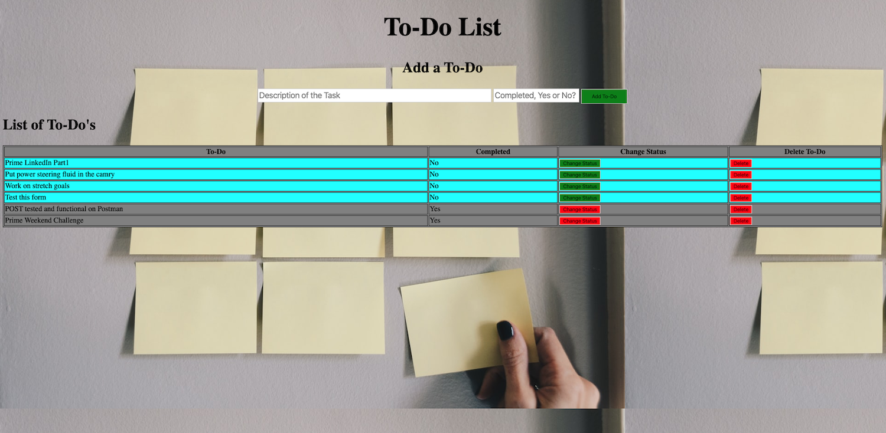
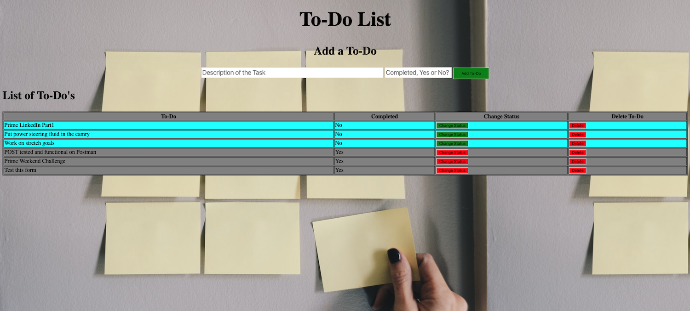
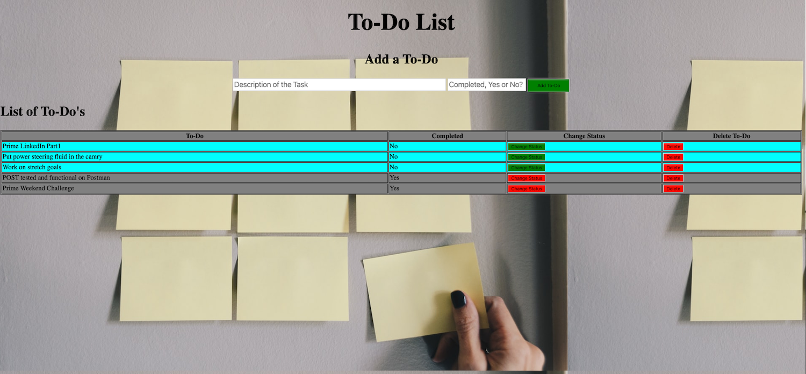

# SQL To-Do-List

## Description
Duration: 12 hours

The SQL To-Do-List is a web application that allows the user to keep track of tasks that need to be done. A user can set a task as being completed or delete the task entirely as needed. All tasks are stored in an SQL database.

## Screen Shots

## Usage
1. Type a task into the input labeled "Description of Task"
2. Type "Yes" or "No" into the input labeled "Completed, Yes or No?"
3. Click on the "Add-To-Do" button, and the task will be added to your to-do list.
4. Tasks that still need to be completed will automatically be filtered to the top of the list, and have an background color of aqua.
5. When you wish change the completion status of a task, click on the "Change Status" button. This will toggle the completion status from 'Yes' to 'No'.
6. If you decide you no longer want a task on the list, click on the "Delete" button to remove it, but beware once deleted the task will be gone from you list and not recoverable.

## Built With
Html, CSS, Javascript, jquery-3.4.1, Node, Express, Body Parser, PostgreSQL, Postico.

## Acknowledgement
Thanks to Prime Digital Academy in Kansas City who equipped and helped me to make this application a reality. Specifically Scott, Myron, and the Tyto cohort.

## Support
If you have suggestions or issues, please email me at allenlucke@gmail.com

